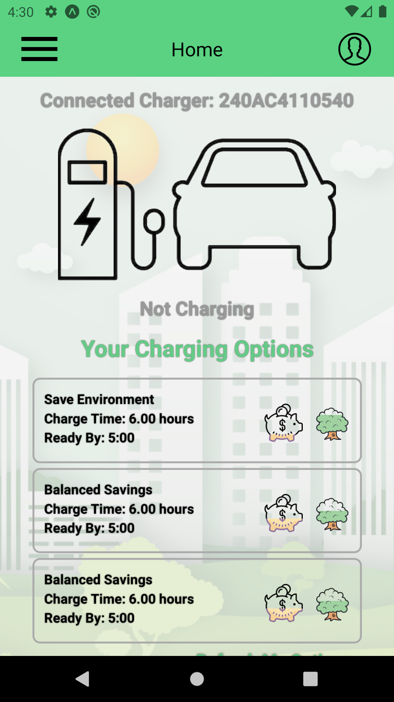
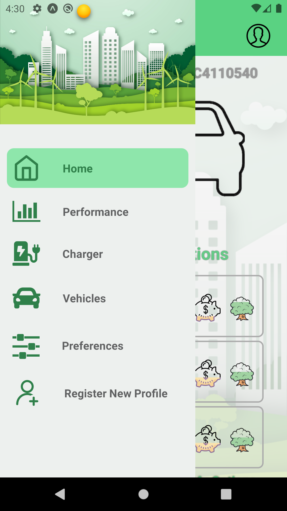
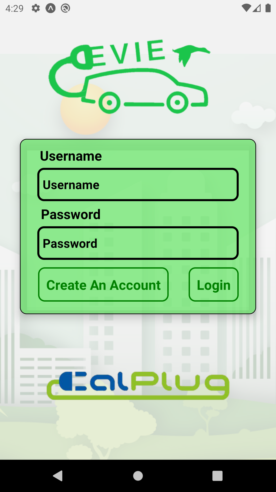
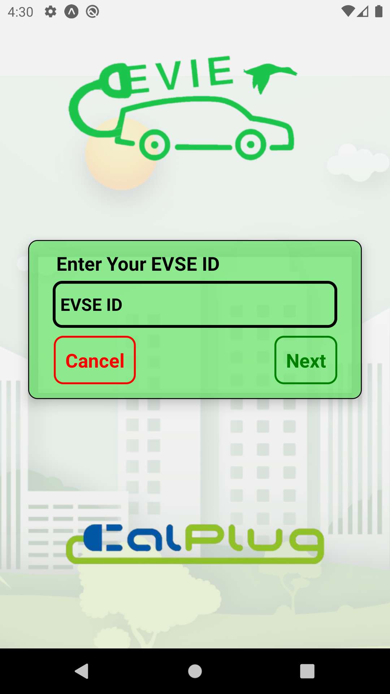

# A Note To Readers

This application was developed for CalPlug of CALIT2 and is part of a larger system of proprietary applications that interface together.  This repository is not the final version of the app that CalPlug currently holds, but this version is viewable by the public under the consent of CalPlug.

# Project Overview

The EVIE Mobile App gives control to a user on how they want to affect their electric vehicle charger.  The application allows users to select from a variety of optimized charging options based on their preferences of Cost, Environment, and Society, which will then trigger a custom J1772 model charger to begin charging using the selected optimization option.  This application interacts with a MongoDB database that stores user credentials, preferences, chargers, cars, and statistics based on their charging performance.  MQTT is involved for communication between the physical charger and mobile application.

Testing MQTT implementation between mobile app and J1772 charger

# Technologies Used

- React Native
- Expo
- Node JS
- MongoDB
- MQTT

# Developers

* Jevford Barro
* Darrel Belen

# Version

1.0.0

# Last Updated

June 11, 2020
